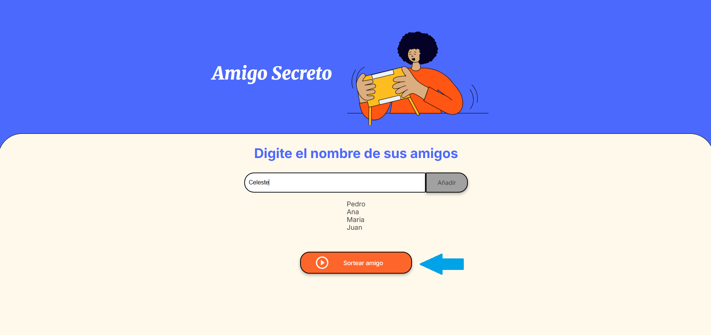
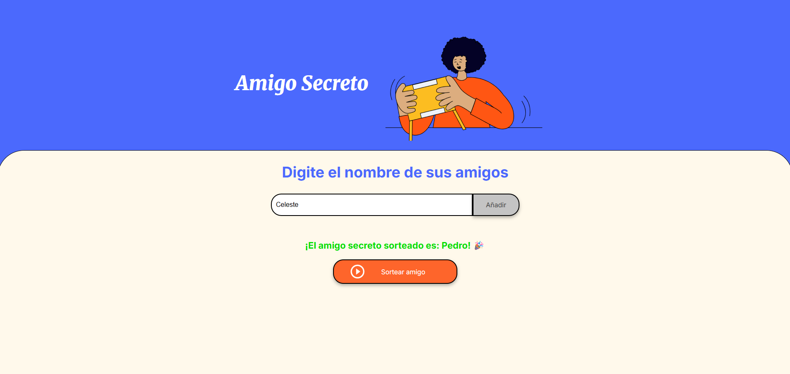

# 🎁 Proyecto Amigo Secreto

¡Bienvenido al proyecto Amigo Secreto! Esta es una aplicación web sencilla y divertida para organizar sorteos de Amigo Secreto de manera rápida y sin complicaciones. Perfecto para reuniones familiares, de amigos o de compañeros de trabajo.

## 🌟 Características

* **Interfaz Intuitiva:** Un diseño limpio y fácil de usar.
* **Añadir Nombres:** Agrega participantes a la lista de forma dinámica.
* **Sorteo Aleatorio:** La aplicación se encarga de sortear un "amigo secreto" de la lista de forma completamente aleatoria, garantizando que nadie se elija a sí mismo.
* **Validaciones:** Requiere un mínimo de 3 participantes para realizar el sorteo y evita nombres vacíos.
* **Funcionalidad en JavaScript:** La lógica de la aplicación está completamente implementada en JavaScript, manejando la adición de nombres y el sorteo.

---

## 🚀 Cómo Usarlo

Usar la aplicación es muy simple:

### 1. Añadir Nombres

Simplemente escribe el nombre de cada participante en el campo de texto y haz clic en el botón **"Añadir"**. Los nombres se irán agregando a la lista debajo.

---

### 2. Realizar el Sorteo

Una vez que hayas añadido a todos los participantes, haz clic en el botón **"Sortear amigo"**. La aplicación seleccionará y mostrará un nombre al azar.

---

### 3. ¡Ver el Resultado!

Después del sorteo, el nombre del afortunado "amigo secreto" aparecerá en la pantalla. ¡Es hora de empezar a pensar en el regalo!

---

## 🛠️ Tecnologías Utilizadas

* **HTML:** Estructura de la página web.
* **CSS:** Estilos y diseño, incluyendo el uso de variables para una gestión más limpia de los colores.
* **JavaScript:** Lógica principal para añadir nombres y realizar el sorteo.

---

## 🤝 Contribuciones

Este proyecto es de código abierto. Siéntete libre de clonar el repositorio, explorar el código y proponer mejoras. Si encuentras algún error o tienes una sugerencia, por favor, abre un "issue" o envía un "pull request".

---

## 📄 Licencia

Este proyecto está bajo la Licencia MIT. Consulta el archivo `LICENSE` para más detalles.

---

## 🤝 Créditos y Agradecimientos

Este proyecto fue desarrollado como parte de un curso de programación. El código base de HTML y CSS fue proporcionado por el programa **Oracle ONE en colaboración con Alura Latam**, lo que me permitió enfocarme en la lógica del proyecto utilizando JavaScript.

¡Disfruta organizando tu próximo Amigo Secreto! 🎉
